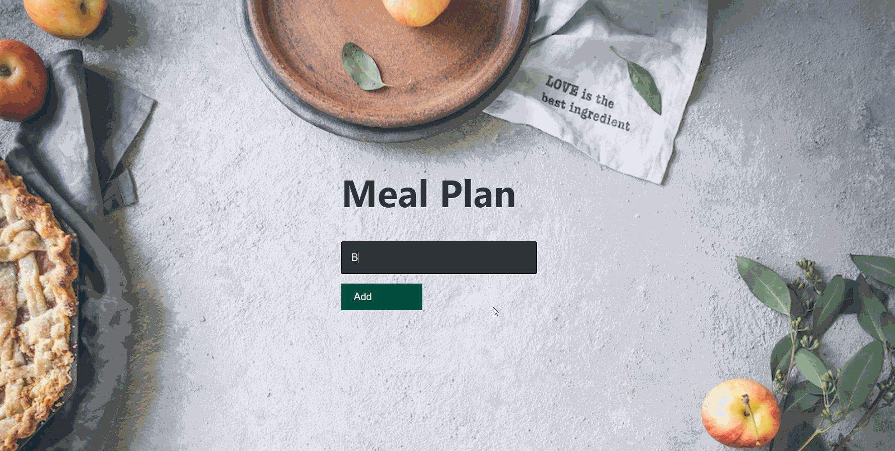

# Meal Plan


## 🦉 Main information

Fullstack MERN (MongoDB for database, Express and Node for backend, and React for frontend) simple Meal Planner application which allows users performing CRUD operations :

- Create a Meal
- Read meals
- Update a meal
- Delete a meal

What is the MERN stack?

MERN stack is a web development framework. It consists of MongoDB, ExpressJS, ReactJS, and NodeJS as its working components. Here are the details of what each of these components is used for in developing a web application when using MERN stack:

- MongoDB — a document-oriented, No-SQL database used to store the application data.
- Express(.js) — a framework layered on top of NodeJS, used to build the backend of a site using NodeJS functions and structures.
- React(.js) — a client-side JavaScript framework. It is a library created by Facebook and it's used to build UI components that create the user interface of the single page web application.
- Node(.js) — is a single-threaded, open-source, cross-platform runtime environment for building fast and scalable server-side and networking applications. 
  #


#

The project goal: 

- Backend features:
   - initialize backend using npm and install necessary packages
   - set up a MongoDB database
   - set up server using Node.js and Express.js 
   - set up a database schema using monoose
   - set up API routes to create, read, update and delete documents from the database
   - set up controller functions for API routes
   - testing API using Postman (or Insomnia)

- Frontend features:
   - unitialize the 'create-react-app frontend' 
   - install 'axios' and use it to send a GET request to the backend to fetch the data
   - use useState and useEffect React Hooks to manipulaite with data
   - create React components and unit them in App.js
   - styling app with CSS in App.css document


## 🦊 Useful links 

### MERN Stack Explained

```
https://www.mongodb.com/mern-stack
```

### MongoDB Basics

```
https://www.mongodb.com/basics?
```

### About Node.js

```
https://nodejs.org/en/about/
```

### Express.js guide

```
https://expressjs.com/en/guide/routing.html
```

## ⚡ Built With

[MongoDB](https://www.mongodb.com/) | [Express.js](https://expressjs.com/) | [React](https://reactjs.org/) 
| [Node.js](https://nodejs.org/en/)